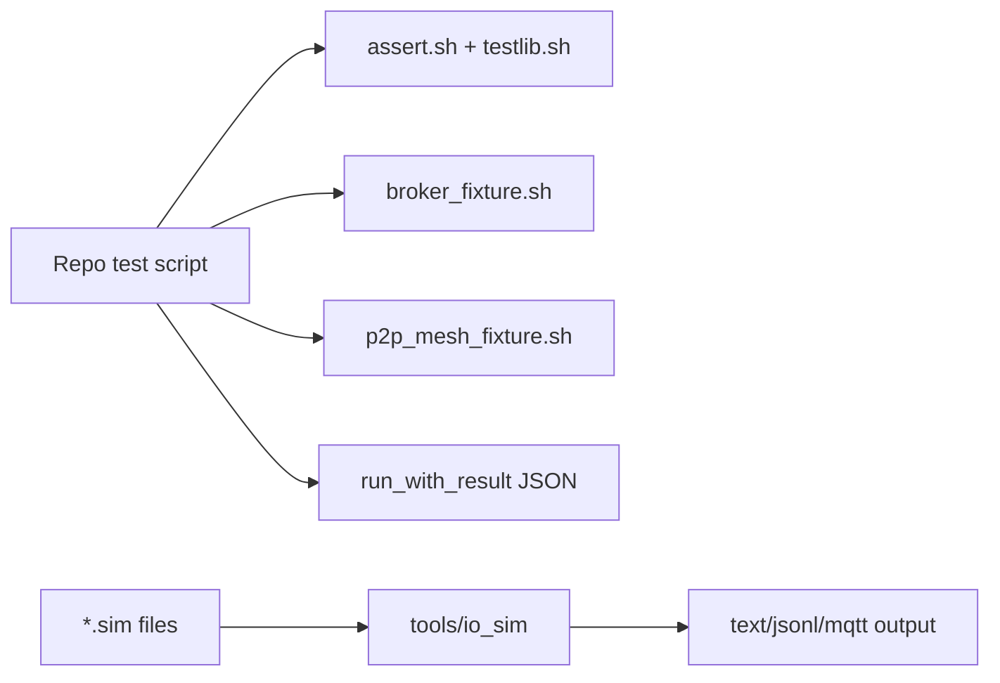
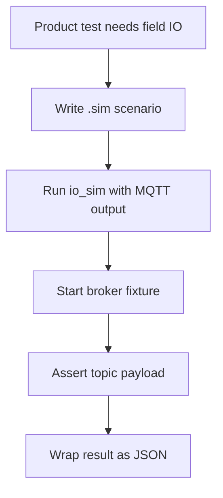

# dephy_testkit

Reusable Linux test harness and IO simulator fixtures for Dephy repos.

## Overview

`dephy_testkit` collects shared test utilities: shell assertions, cleanup,
ports, eventual assertions, broker/P2P fixtures, JSON result wrapping, and
scenario-driven industrial IO simulation.

## Key Value

- Reduces duplicated shell test code across product and module repos.
- Provides broker build/start helpers and static-seed P2P mesh fixtures.
- Runs deterministic IO scenarios for DI, DO, AI, AO, fault, stuck-at, and noise.
- Emits machine-readable JSON result summaries for CI aggregation.
- Supports larger IO scenario regression for simulator output stability.

## How To Use

```sh
make test
make io-sim
scripts/run_with_result.sh smoke true
out/io_sim scenarios/basic_io.sim
out/io_sim --mqtt --site factory-a --node node-7 scenarios/basic_io.sim
out/io_sim --format jsonl scenarios/large_io.sim
```

## Architecture Flow



## Example User Scenario



## Simple Principle

Tests should describe behavior. Testkit owns repeatable fixtures, cleanup, and
simulation mechanics.

## Docs

- `docs/module_structure.md`: scripts, tools, scenarios, and tests.
- `docs/todo.md`: current TODO summary.

## License

MIT. See `LICENSE` and `NOTICE.md`. Reuse and references are allowed, but the
copyright notice and attribution to Judd (judadao) must be preserved.
